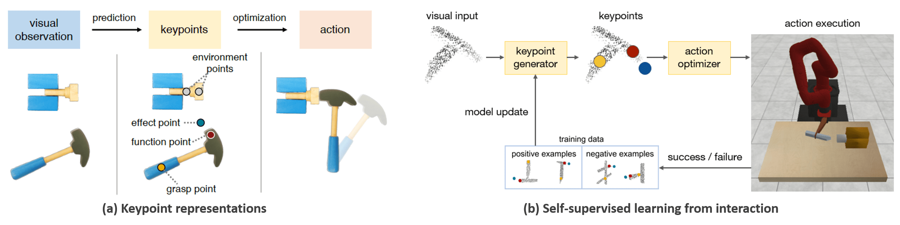

## KETO: Learning Keypoint Representations for Tool Manipulation

[Zengyi Qin](https://zengyi-qin.github.io/), [Kuan Fang](http://ai.stanford.edu/~kuanfang/), [Yuke Zhu](http://ai.stanford.edu/~yukez/), [Li Fei-Fei](http://svl.stanford.edu/people/) and [Silvio Savarese](http://svl.stanford.edu/people/)



\[[arXiv](https://arxiv.org/abs/1910.11977)\]

### Prerequisite

CUDA 10.0

### Install

Clone this repository
```bash
git clone -b release https://github.com/kuanfang/kptog.git
```

Denote the repository path as `KETO`. Download and extract [data.tar.gz](https://cloud.tsinghua.edu.cn/f/2375b7da83b44db8aaff/?dl=1) in `KETO` and [models.tar.gz](https://cloud.tsinghua.edu.cn/f/39abcf2cf120486fa191/?dl=1) in `KETO/keypoints`. Then the directory should contain `KETO/data` and `KETO/keypoints/models`. Create a clean virtual environment with Python 3.6. If you are using Anaconda, you could run `conda create -n keto python=3.6` to create an environment named keto and activate this environment by `conda activate keto`. `cd KETO` and execute commands as the followings.

Install the dependencies:
```bash
python setup.py
```

### Quick Demo

Run pushing:
```bash
sh scripts/run_push_test.sh
```

Run reaching:
```bash
sh scripts/run_reach_test.sh
```

Run hammering:
```bash
sh scripts/run_hammer_test.sh
```

### Train from Scratch

#### Grasping
Run the random grasping policy to collect training data:
```bash
sh scripts/run_grasp_random.sh
```
In the experiment, we ran 300 copies of `run_grasp_random.sh` in parallel on machines with over 300 CPU cores, collecting 100K episodes. GPUs are unnecessary here, since the running time is mostly consumed by CPUs. The data will be saved to `episodes/grasp_4dof_random`, including the grasp location, rotation and a binary value indicating whether the grasp succeeded, as well as the point cloud input associated with each grasp. We store the collected data in a single hdf5 file to boost the data access in training:
```bash
cd keypoints && mkdir data
```

```bash
python utils/grasp/make_inputs_multiproc.py --point_cloud ../episodes/grasp_4dof_random/point_cloud --grasp ../episodes/grasp_4dof_random/grasp_4dof --save data/data_grasp.hdf5
```

Train the variational autoencoder (VAE):
```bash
python main.py --mode vae_grasp --data_path data/data_grasp.hdf5 --gpu GPU_ID
```
Train the grasp evaluation network:
```bash
python main.py --mode gcnn_grasp --data_path data/data_grasp.hdf5 --gpu GPU_ID
```
The VAE generates grasp candidates from the input point cloud, while the evaluation network scores the quality of the candidates. The above two commands are independent and can be run in parallel to save time. After training, we merge the VAE and the evaluator as a single checkpoint:
```bash
python merge.py --model grasp --vae runs/vae/vae_60000 --discr runs/gcnn/gcnn_60000 --output models/cvae_grasp
```

#### Keypoint Prediction
Each of the three tasks needs its own keypoint prediction model. Here we take the pushing task as an example. The training procedure for other tasks are the same. `cd KETO` and start from collecting the training data using heuristic keypoint predictor:
```bash
sh scripts/run_push_random.sh
```
where we collect 100K episodes of data. `run_push_random.sh` relies on the grasping model `keypoints/models/cvae_grasp` that we saved just now to predict grasps from the observation. It no longer uses the random grasping policy. After data collection, we store all the data in a single hdf5 file:
```bash
cd keypoints && python utils/keypoint/make_inputs_multiproc.py --point_cloud ../episodes/push_point_cloud/point_cloud --keypoints ../episodes/push_point_cloud/keypoints --save data/data_push.hdf5
``` 

Train the VAE:
```bash
python main.py --mode vae_keypoint --data_path data/data_push.hdf5 --gpu GPU_ID
```
Train the keypoint evaluation network:
```bash
python main.py --mode discr_keypoint --data_path data/data_push.hdf5 --gpu GPU_ID
```
The VAE produces keypoint candidates from the input point cloud, while the evaluation network scores the candidates to select the best one as output. The above two commands can be run in parallel to save time. After training, we merge the VAE and the evaluator as a keypoint predictor for the pushing task:
```bash
python merge.py --model keypoint --vae runs/vae/vae_keypoint_push_120000 --discr runs/discr/discr_keypoint_push_120000 --output models/cvae_keypoint_push
```
Merge the grasp predictor and the keypoint predictor to obtain the final model:
```bash
python merge.py --model grasp_keypoint --grasp models/cvae_grasp --keypoint models/cvae_keypoint_push --output models/cvae_push
```
Finally, `cd KETO` and see the performance of your own model by running 
```bash
sh scripts/run_push_test.sh
```
For training other two tasks, you could simply replace push with reach or hammer in the above commands.


### Citation
```bash
@misc{qin2019keto,
    title={KETO: Learning Keypoint Representations for Tool Manipulation},
    author={Zengyi Qin and Kuan Fang and Yuke Zhu and Li Fei-Fei and Silvio Savarese},
    year={2019},
    eprint={1910.11977},
    archivePrefix={arXiv},
}
```
